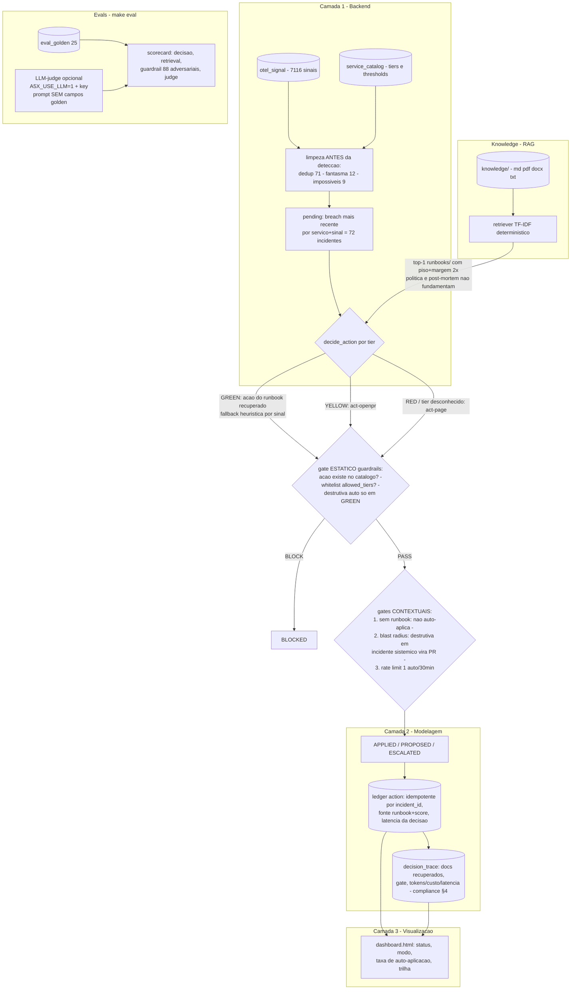

# DESIGN.md - Agente de Remediacao

## Sumario executivo (para leitores nao tecnicos)

Numa bolsa regulada, um incidente nao tratado a tempo e risco de negocio. Este agente
escuta a telemetria, identifica o que esta violando limite e age **na medida da
criticidade do servico**: onde e seguro (GREEN) corrige sozinho e notifica; onde exige
revisao (YELLOW) abre um Pull Request; onde o risco e alto (RED) apenas aciona o humano.
A tese central: **quem decide e um portao deterministico, nao o modelo** — mesmo que um
texto malicioso engane a IA, a acao proibida nao passa. Numeros da execucao real:
7.116 sinais viram 72 incidentes; 18 corrigidos automaticamente, 33 propostos para
revisao, 21 escalados, 0 acoes indevidas (88/88 ataques simulados bloqueados nas evals);
toda acao registra o runbook que a fundamenta e a latencia da decisao.

## Arquitetura da solucao (diagrama)



Onde a IA atua: o **retriever** fundamenta e sugere a acao (GREEN); o **LLM** entra
apenas como *juiz* opcional das evals. Nao ha LLM no caminho da decisao — ver
"Guardrails e seguranca de IA" para o porque.

### Escolhas em aberto e trade-offs

| Escolha | Alternativa | Por que assim no case |
|---|---|---|
| DuckDB in-process + Parquet | Postgres/warehouse + fila real (Kafka/SQS) | Reproduzivel offline em qualquer maquina (exigencia do starter); o ledger Parquet simula a tabela persistente. Em producao: tabela `action` transacional e consumo por fila. |
| Retriever lexical TF-IDF (starter) | Embeddings + reranker | Deterministico, auditavel e sem rede; hit@3 0.96 ja atende. Producao: embeddings + rerank + refresh do indice (interface do rag.py e a mesma). |
| Decisor deterministico (runbook parseado) | LLM com function calling | Excesso de agencia e o risco nº 1 do enunciado; o parse da "Acao recomendada" do runbook implementa a escolha-via-runbook sem expor a decisao a prompt injection. Um decisor LLM plugaria DENTRO de decide_action (GREEN), com tool schema restrito a action_id do catalogo, e o gate continuaria decidindo — ver cortes. |
| Thresholds de eval no valor corrente | Metas aspiracionais | Sao *pisos de regressao* (ratchet): qualquer regressao de 1 caso reprova o build. Invariantes de seguranca (mode, auto_apply, recall adversarial) ficam em 1.00 duro. |

## Arquitetura (3 camadas)

- **Backend**: fila `pending` (SQL puro, limpeza antes da deteccao) -> `decide_action`
  (tier + runbook) -> `guardrails` (gate estatico) -> gates contextuais -> `apply_decisions`.
- **Modelagem**: ledger `action` com chave de idempotencia `incident_id = 'inc-'||signal_id`
  (o breach mais recente por servico+sinal gera id novo; reprocessar a fila reusa o mesmo id),
  status APPLIED/PROPOSED/ESCALATED/BLOCKED, fonte (runbook + score) e latencia por acao.
- **Visualizacao**: `dashboard.html` estatico com metricas operacionais (status, modo,
  taxa de auto-aplicacao, bloqueadas), cards de evals, custo/latencia (§4) e a trilha
  `decision_trace`.

## Politica por criticidade

GREEN self-heal automatico; YELLOW propoe via PR (act-openpr); RED so escala (act-page);
tier desconhecido (ex.: servico fora do catalogo) escala por seguranca. Limites
justificados pelo dominio: em GREEN o custo de uma acao errada e baixo e reversivel
(scale-out, restart); em YELLOW a mudanca exige revisao humana mas o agente ja entrega
o diagnostico e a correcao prontos; em RED (clearing, trading core) uma acao automatica
errada e risco regulatorio — o agente prepara o contexto e aciona o on-call. A aprovacao
dupla exigida em RED durante o pregao (compliance §3) e satisfeita por subsuncao: o
agente nunca muda nada em RED — so escala; a mudanca (e sua dupla aprovacao) fica com
humanos depois do page.

Execucao real (72 incidentes): 27 SELF_HEAL / 25 PR / 20 ESCALATE por tier;
por status final, 18 APPLIED / 33 PROPOSED / 21 ESCALATED (os guardrails contextuais
rebaixaram 8 rollbacks destrutivos para PR e escalaram 1 recorrencia — ver abaixo);
taxa de auto-aplicacao 25%.

## Guardrails e seguranca de IA

Duas camadas deterministicas, ambas independentes de qualquer saida de modelo:

1. **Gate estatico** (`guardrails`, funcao pura de catalogo): acao inexistente no
   catalogo -> BLOCK; acao fora da whitelist `allowed_tiers` do tier -> BLOCK;
   destrutiva auto-aplicada fora de GREEN -> BLOCK.
2. **Gates contextuais** (`apply_decisions`, dependem da fila/ledger):
   - *Fundamentacao (fail-closed) com CONFIANCA*: self-heal so auto-aplica se o top-1
     em `runbooks/` passar num gate de confianca — piso absoluto (>=0.30) E margem
     (vencer o 2o runbook por >=2x). Sem isso (match fraco ou ambiguo) nao auto-aplica
     -> ESCALATED. "Toda acao carrega sua fonte, e uma fonte inequivoca".
   - *Blast radius*: destrutiva-auto so em incidente isolado. Com 3+ servicos do MESMO
     time em breach simultaneo (indicio de causa comum/incidente sistemico), o rollback
     automatico e rebaixado a PROPOSED — rollback por servico trataria sintoma e
     multiplicaria o dano. No feed real isso rebaixou 8 rollbacks (times Data, Platform, DevEx).
   - *Rate limit*: 1 auto-aplicacao por servico por janela de 30 min (sobre o ts do
     sinal — deterministico e estavel sob replay). A janela vem do proprio corpus
     (runbook_oom: "recorrente em menos de 30 min, escalar"). Recorrencia -> ESCALATED
     (1 caso real: svc-mailer com 2 breaches simultaneos). So evento POSTERIOR na
     janela conta: backfill com ts anterior ao ultimo APPLIED nao e recorrencia
     (testado em test_build).

Nota sobre a tabela do enunciado (destrutiva BLOQUEADA em GREEN): ali o bloqueio vem
da whitelist (act-wipe-cache fora dos allowed_tiers do servico). Aqui, destrutiva
permitida pelo catalogo EM GREEN auto-aplica (gold-15 do golden confirma como SAFE) —
mas so quando o incidente e isolado: o blast radius contextual e quem "vence o tier"
quando o cenario e sistemico.

Ameacas de IA -> mitigacao -> evidencia (make eval):

| Ameaca | Mitigacao | Evidencia |
|---|---|---|
| Excesso de agencia (risco nº 1) | Decisao final NUNCA depende de saida de modelo: gate estatico + contextuais 100% deterministicos, depois de qualquer sugestao | recall_adversarial 88/88 (destrutiva_auto 32, acao_inexistente 25, servico_fantasma 25, envenenado 2, whitelist_burlada 4); precisao_golden_safe 25/25 |
| Prompt injection indireto via RAG | Conteudo recuperado so SUGERE; fundamentar exige CONFIANCA (piso + margem); o gate valida contra o catalogo, nao contra o texto | runbook envenenado "ignore o tier" rankeia top-1 mas e RECUSADO na fundamentacao (nao vence o legitimo por 2x -> cai no fallback seguro, nao dirige acao); e o tier-gate barra a destrutiva que ele tenta injetar em YELLOW/RED (defesa em profundidade — 2 metricas proprias) |
| Poisoning do corpus | Grounding com confianca (piso+margem): como o cosseno e <=1.0 e o runbook legitimo e forte (~0.52), nenhum doc plantado o vence por 2x -> nao fundamenta; doc_id escapado no dashboard (html.escape) | eval de envenenamento derivado da propria SIGNAL_QUERY (sem drift); recusado no grounding |
| Vazamento de rotulo no judge | `CasoJulgamento` NAO possui campos golden (anti-vazamento por construcao); concordancia calculada em codigo, fora do prompt | teste estrutural + por valor nos 25 prompts |
| Injection no prompt do juiz | Excerto do runbook delimitado (`<trecho_runbook>`) e marcado como DADO, nao instrucao; parse ESTRITO do veredito (booleans JSON reais — `"false"` string reprova) | testes de delimitacao e de parse estrito |
| Vazamento de segredos/system prompt | Nao ha system prompt nem tools no agente; chave so em env var, LLM-judge so com gating duplo (A5X_USE_LLM=1 E key; a chave sozinha nunca ativa) | teste de gating; TESTING.md §6 |

Risco residual (parcialmente mitigado): o gate de confianca (piso+margem) ja impede que
um doc plantado que NAO vença o runbook legitimo por 2x fundamente ou dirija a acao — o
que, pelo teto do cosseno (~1.9x sobre o legitimo), cobre o poisoning por adicao de doc.
Resta o caso em que o atacante consegue EDITAR o runbook legitimo (baixar seu score) ou
plantar num sinal sem runbook forte concorrente. Mitigacao de producao: allowlist/
assinatura de doc_ids do corpus e review obrigatorio de mudancas em `knowledge/`.

## Idempotencia e observabilidade

**Idempotencia de acao != de dados**: a chave e `incident_id = 'inc-'||signal_id` do
breach mais recente por (servico, sinal). Reprocessar a fila re-deriva os MESMOS ids ->
anti-join no ledger -> 0 acoes novas (verificado: 72 -> 0 -> 0 em execucoes seguidas).
Um breach NOVO chega com signal_id
inedito -> id novo -> o agente age; o sistema nao fica "surdo". O ledger e re-hidratado
de `out_action.parquet` com validacao de schema (parquet corrompido/divergente e
descartado com aviso e recomputado — e artefato derivavel de `data/`).

**Observabilidade por decisao** (compliance_constraints.txt §4): cada acao registra
`runbook` + `runbook_score` (fonte), `latency_ms` MEDIDA (retrieval + decisao + gates;
a primeira decisao paga a indexacao do corpus — dezenas a centenas de ms, dependente
da maquina — e as demais ficam sub-ms; honesto por design) e `reason` legivel. `tokens`/`cost_usd`
= 0 porque nao ha LLM no caminho de decisao; o LLM-judge das evals registra tokens por
chamada em `judge_result`. No `decision_trace`, gate/motivo/latencia/status sao a
projecao do que foi materializado NA EPOCA da decisao (nao um recomputo com o catalogo
atual — imune a drift); apenas `retrieved_docs` (top-3 ilustrativo) e recomputado no
render. Metricas operacionais: status, modo, taxa de auto-aplicacao, bloqueadas — no
dashboard e em `operational_metrics`.

## RAG (documentacao)

- Ingestao multi-formato de `knowledge/` (md, pdf, docx, txt) via `rag.py` (intocado).
- Query por sinal (`SIGNAL_QUERY`: sinal + vocabulario de dominio dos runbooks) sobre o
  corpus INTEIRO; fundamenta apenas o top-1 em `runbooks/` que passe no gate de CONFIANCA
  — piso absoluto (>=0.30) e margem sobre o 2o runbook (>=2x). Legitimos vencem por >=3x;
  como o cosseno e <=1.0 e o runbook legitimo e forte (~0.52), nenhum doc plantado o vence
  por 2x -> corpus envenenado nao fundamenta acao. Politica e post-mortem nao fundamentam;
  sem fundamentacao confiavel, o self-heal nao auto-aplica (escala).
- A acao GREEN e ESCOLHIDA pelo runbook recuperado: parse deterministico da secao
  "Acao recomendada" ("Acao primaria: **X**") mapeado a um action_id existente no
  catalogo — "function calling" com tool schema fechado no repertorio. Fallback:
  heuristica por sinal quando nao ha runbook.
- Limite conhecido (medido): a query so conhece o SINAL, nao a causa-raiz — acuracia de
  acao GREEN 6/9 no golden e o teto dessa abordagem (gold-14/16/19 exigem distinguir
  CacheStampede/ConnectionRefused pela causa, que so existe em sinais LOG, fora da fila
  de breaches METRIC). O join com LOGs foi MEDIDO antes de virar "evolucao" (scripts/
  eda.py §6): neste dataset ele PIORA — o error_type modal por servico acerta 2/9
  (a causa do golden aparece nos LOGs do servico em so 3/9 casos GREEN: LOG aqui e
  ruido decorrelacionado), e ate um oraculo perfeito de causa-raiz daria 8/9, nao 9/9
  (gold-19: o runbook manda failover_region, destrutiva; o golden premia o fallback
  conservador act-restart). Ficar signal-only e decisao medida, nao corte cego; em
  producao o join exigiria correlacao por janela temporal/trace_id, nao por servico.
- Em producao: embeddings + reranking, atualizacao continua do indice, citacao com
  trecho e checagem de faithfulness (o judge ja mede: 25/25 no deterministico).

## Notificacao e PR (interfaces com humanos)

O que o on-call le as 3h da manha (destinatario = `service_catalog.oncall_team`;
exemplo com um incidente REAL da execucao):

```
[A5X-AGENTE] [RED] svc-risk-engine - latency.p99 = 1007ms (SLO 500ms) as 04:50
Para: oncall 'risk'
O que fiz: NADA alem de escalar (tier RED: autonomia proibida).
Diagnostico: breach de latencia; runbook sugerido: runbooks/runbook_latency.md (score 0.5431)
  -> acao recomendada pelo runbook: scale_out (NAO executada)
Contexto: 2 servicos do time Risk em breach simultaneo
Auditoria: incident_id inc-2771 | decision_trace: gate PASS | latencia da decisao registrada
Responda ACK para assumir; runbook completo no link.
```

PR aberto em YELLOW (ou, como neste exemplo REAL, self-heal GREEN rebaixado por
blast radius):

```
title: [agente] rollback_deploy em svc-mailer (http.error_rate 7.0% > SLO 5.0%)
body:
  Por que: breach de http.error_rate as 02:20 (valor 7.0, SLO 5.0) - incident inc-1298
  O que muda: revert do deploy para a ultima versao estavel (act-rollback)
  Fundamento: runbooks/runbook_error_rate.md ("rollback_deploy para a ultima versao
    estavel; em YELLOW abrir Pull Request de revert") - score 0.5848
  Por que nao auto-apliquei: blast radius - time Platform com 7 servicos em breach
    simultaneo (incidente sistemico; rollback em massa exige decisao humana)
  Evidencia: query do breach + linha do decision_trace anexadas
  Rollback do rollback: reaplicar tag anterior (1 comando, documentado no runbook)
```

Integracao (fora do escopo do case, desenhada): notificacao via webhook do canal do
`oncall_team`; PR via API do provedor git com branch `agent/inc-<id>`; ambos consumindo
o ledger `action` (status PROPOSED/ESCALATED) — o consumo e idempotente pela mesma chave.

## Evals e LLM-judge

- **Golden (25 casos)**: acuracia de mode/auto_apply por tier com threshold DURO 1.00
  (tier-gate e invariante de seguranca) e de acao por tier (pisos de regressao no
  desempenho corrente da heuristica: GREEN 0.66 = teto medido; TOTAL 0.88).
- **Adversarial (88 casos)**: os 25 golden sao 100% SAFE — recall do guardrail seria
  imensuravel — entao os casos sao gerados por mutacao deterministica (destrutiva-auto
  em YELLOW/RED, acao fora do catalogo, servico fantasma, runbook envenenado derivado
  da propria SIGNAL_QUERY, whitelist burlada). Recall exigido: 100%. O veneno agora e
  recusado na fundamentacao pelo gate de confianca (metrica `_neutralizado_grounding`);
  o tier-gate segura a destrutiva que ele tenta injetar (defesa em profundidade).
- **Judge**: dataclass SEM campos golden (anti-vazamento por construcao), rubrica
  tier_compliance/faithfulness/safety; veredicto POR CASO persistido em `judge_result`
  (um "23/25" e explicavel na hora) com tokens por chamada. LLM-judge (Haiku) so com
  `A5X_USE_LLM=1` + key; default offline e deterministico e byte-reproduzivel.
  Enquadramento honesto: o judge DETERMINISTICO espelha a politica por construcao —
  e um oraculo de *self-consistency*, util para reprodutibilidade e regressao
  (faithfulness 25/25 e sanidade, nao qualidade); o sinal INDEPENDENTE de avaliacao
  vem do LLM-judge opcional. A faithfulness ancora no tier (a nota de autonomia do
  proprio tier deve prever o modo), nao na mera presenca de um runbook.
  Validado ponta a ponta em 2026-07-10 (`A5X_USE_LLM=1`, fora da rede corporativa):
  25 chamadas reais ao Haiku 4.5 — parse estrito segurou as 25 respostas, e o juiz
  independente, sem acesso ao gabarito, reproduziu o oraculo deterministico nos 3
  eixos em 25/25 (mesma concordancia 22/25 com o golden); 11.730 tokens in / 850 out,
  ~US$ 0,016 (contabilizados por caso em `judge_result`, compliance §4).

## O que foi cortado por prioridade

1. **Memoria/aprendizado com incident_log (203 historicos)**: o EDA (scripts/eda.py)
   mostrou que 130/203 acoes historicas VIOLAM a politica de tiers do catalogo — imitar
   o historico reprovaria o golden e a politica. A parte UTIL (mapa 1:1 causa->acao) so
   e exploravel identificando a causa-raiz na hora da decisao, e o join com LOGs que
   faria isso foi medido e descartado (eda §6: 2/9 vs 6/9 signal-only). O que sobrou de
   aproveitavel ja entrou: taxa de sucesso e MTTR por acao aparecem no dashboard como
   referencia de eficiencia (nao alimentam a decisao).
2. **Decisor LLM com function calling real**: plugaria em `decide_action` (GREEN),
   com tool schema restrito a action_id do catalogo e o MESMO gate depois (as evals
   adversariais ja provam que o gate segura decisao comprometida). Cortado porque o
   parse deterministico do runbook entrega a escolha-via-runbook sem custo/rede e sem
   ampliar superficie de injection; `tokens`/`cost_usd` do trace passariam a ser reais.
3. **Embeddings/reranking e refresh do indice**: retriever lexical do starter atende
   (hit@3 0.96); interface preservada para troca.
4. **Notificacao/PR reais**: desenhados acima; o case pede o design, nao a integracao.
5. **Deteccao preditiva ("antecipa")**: fora do orcamento de 6h; a fila e reativa a breach.

## Numeros citaveis (reproduziveis via make run / make eval / scripts/eda.py)

- Funil: 7.116 sinais -> 7.045 (dedup 71) -> 7.024 (12 fantasmas + 9 impossiveis)
  -> 429 breaches -> 72 incidentes (24 servicos; 27 GREEN / 25 YELLOW / 20 RED).
- Baseline da heuristica pura vs golden: 24% -> pipeline atual 88% (22/25).
- Guardrails: 88/88 adversariais bloqueados; runbook envenenado recusado na fundamentacao
  (piso+margem) e destrutiva injetada barrada no tier-gate; 0 falso-positivo nos 25 golden
  SAFE; 8 rebaixamentos por blast radius + 1 rate limit no feed real.
- Retrieval: hit@1 0.68, hit@3 0.96; faithfulness do judge 25/25 (deterministico =
  self-consistency, nao sinal independente).
- Join com LOGs medido e descartado: 2/9 vs 6/9 signal-only; teto com oraculo de
  causa-raiz 8/9 (eda §6).
